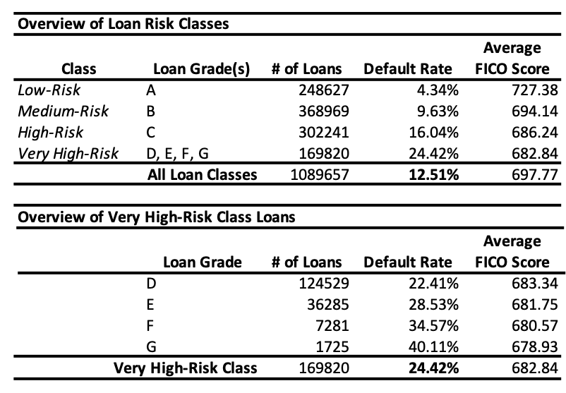

# Data Analysis for Upstart Long [ICONIQ Case Competition]
1: CreditKarma Review Scraping  
    - Analyzed thousands of scraped CreditKarma reviews to assess cumulative positive sentiment  
    - Conducted SEO research to generate monthly visitors and organic CTR rates from personal loan companies  
   
2: LendingClub Loan Overview  
    - Analyzed over million loans accepted by LendingClub to assess default risk and average FICO score per credit grade  

  

